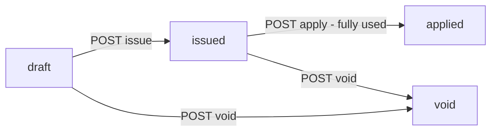
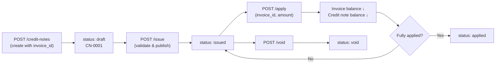

# Credit Notes — Frontend API Reference

All endpoints require `Authorization: Bearer <token>` and are prefixed with `/api`.

---

## Status Flow



> [!NOTE]
> Only `draft` credit notes can be edited or deleted. Only `issued` credit notes can be applied to an invoice.

---

## 1. Create a Credit Note

**`POST /api/credit-notes`**

Create a credit note linked to a specific invoice. It starts as `draft`.

### Request Body
```json
{
  "invoice_id": "<uuid>",         // required — invoice to credit against
  "customer_id": "<uuid>",        // optional — defaults to invoice's customer
  "credit_note_date": "2026-02-19",  // required
  "expiry_date": "2026-03-19",    // optional
  "reason": "Returned goods",     // optional, shown to customer
  "currency": "KES",              // optional, defaults to invoice currency
  "notes": "Internal note",       // optional
  "line_items": [
    {
      "description": "Returned tiles",   // required
      "quantity": 5,                      // required
      "unit_price": 1200,                 // required
      "product_id": "<uuid>",            // optional
      "variant_id": "<uuid>",            // optional
      "unit": "pcs",                     // optional, default "pcs"
      "discount_amount": 0,              // optional, default 0
      "tax_rate": 16                     // optional %, default 0
    }
  ]
}
```

### Response `201`
```json
{
  "message": "Credit note created successfully",
  "data": {
    "id": "<uuid>",
    "credit_note_number": "CN-0001",
    "status": "draft",
    "total_amount": "6960.00",
    "amount_applied": "0.00",
    "balance_amount": "6960.00",
    "invoice_id": "<uuid>",
    "customer": { ... },
    "invoice": { ... },
    "line_items": [ ... ]
  }
}
```

---

## 2. List Credit Notes

**`GET /api/credit-notes`**

### Query Parameters
| Param | Type | Description |
|---|---|---|
| `invoice_id` | uuid | Filter by invoice |
| `customer_id` | uuid | Filter by customer |
| `status` | string | `draft` \| `issued` \| `applied` \| [void] |
| `per_page` | int | Default 15 |

---

## 3. Get Credit Notes for an Invoice

**`GET /api/credit-notes/by-invoice/{invoiceId}`**

Useful for showing a credit notes panel on the invoice detail page.

### Response `200`
```json
{
  "invoice": {
    "id": "<uuid>",
    "invoice_number": "INV-0001",
    "total_amount": "50000.00",
    "amount_paid": "6960.00",
    "balance_amount": "43040.00",
    "status": "sent"
  },
  "credit_notes": [ ... ],
  "total_credits_issued": 6960.00,
  "total_credits_applied": 6960.00
}
```

---

## 4. Show a Credit Note

**`GET /api/credit-notes/{id}`**

 Returns the credit note with all line items, customer, and linked invoice.

---

## 5. Update a Credit Note

**`PUT /api/credit-notes/{id}`**

Only works when `status === "draft"`. Accepts the same fields as create (except `invoice_id`). Providing `line_items` will replace all existing line items.

---

## 6. Delete a Credit Note

**`DELETE /api/credit-notes/{id}`**

Only works when `status === "draft"`.

---

## 7. Issue a Credit Note

**`POST /api/credit-notes/{id}/issue`**

Publishes the credit note: `draft → issued`. No body required.

> [!IMPORTANT]
> Only issued credit notes can be applied to an invoice. Validate that `total_amount > 0` before enabling this button in the UI.

### Response `200`
```json
{
  "message": "Credit note issued successfully",
  "data": { "status": "issued", "issued_at": "2026-02-19T14:09:00Z", ... }
}
```

---

## 8. Apply Credit Note to Invoice

**`POST /api/credit-notes/{id}/apply`**

Reduces the invoice's outstanding balance by the credit amount. The credit note and invoice are updated atomically.

### Request Body
```json
{
  "invoice_id": "<uuid>",   // required — must belong to the same customer
  "amount": 3000.00         // optional — defaults to full remaining credit balance
}
```

### Response `200`
```json
{
  "message": "Credit note applied successfully",
  "applied": 3000.00,
  "credit_note": {
    "status": "issued",
    "amount_applied": "3000.00",
    "balance_amount": "3960.00"
  },
  "invoice": {
    "balance_amount": "40040.00",
    "amount_paid": "9960.00",
    "status": "sent"
  }
}
```

> [!TIP]
> The `applied` field tells you exactly how much was deducted. Always refresh both the invoice and credit note in the UI after this call.

---

## 9. Void a Credit Note

**`POST /api/credit-notes/{id}/void`**

Permanently cancels the credit note. No body required.

> [!CAUTION]
> Cannot be reversed. Fails if any amount has already been applied (`amount_applied > 0`).

---

## Credit Note Object Reference

| Field | Type | Description |
|---|---|---|
| [id](file:///Users/inchwara/Dev/citimaxerp-backend/app/Models/CreditNote.php#149-153) | uuid | Unique ID |
| `credit_note_number` | string | Auto-generated e.g. `CN-0001` |
| `invoice_id` | uuid | The linked invoice |
| `customer_id` | uuid | The customer |
| `status` | string | `draft` \| `issued` \| `applied` \| [void](file:///Users/inchwara/Dev/citimaxerp-backend/app/Http/Controllers/CreditNoteController.php#467-507) |
| `credit_note_date` | date | Date of issue |
| `expiry_date` | date\|null | Optional expiry |
| `reason` | string\|null | Reason for credit |
| `subtotal` | decimal | Sum of line item base amounts |
| `discount_amount` | decimal | Total discounts |
| `tax_amount` | decimal | Total tax |
| `total_amount` | decimal | Final credit value |
| `amount_applied` | decimal | How much has been applied |
| `balance_amount` | decimal | Remaining credit (`total - applied`) |
| `currency` | string | e.g. `KES` |
| `issued_at` | datetime\|null | When issued |
| `applied_at` | datetime\|null | When fully applied |
| `voided_at` | datetime\|null | When voided |


## API Endpoints (all under `auth:sanctum`)

| Method | URL | Description |
|---|---|---|
| `GET` | `/api/credit-notes` | List credit notes (filter: `invoice_id`, `customer_id`, `status`) |
| `POST` | `/api/credit-notes` | Create a new credit note |
| `GET` | `/api/credit-notes/{id}` | Show a credit note with line items |
| `PUT/PATCH` | `/api/credit-notes/{id}` | Update a draft credit note |
| `DELETE` | `/api/credit-notes/{id}` | Delete a draft credit note |
| `GET` | `/api/credit-notes/by-invoice/{invoiceId}` | All credit notes for an invoice |
| `POST` | `/api/credit-notes/{id}/issue` | Issue: `draft → issued` |
| `POST` | `/api/credit-notes/{id}/apply` | Apply credit to invoice balance |
| `POST` | `/api/credit-notes/{id}/void` | Void the credit note |

## Typical Workflow



## [applyToInvoice] Logic

1. Validates credit note is `issued` with remaining balance
2. Validates invoice belongs to the same company **and** customer
3. Applies `min(credit_balance, invoice_balance, requested_amount)`
4. Atomically updates both records in a DB transaction
5. Auto-sets credit note status to `applied` when fully consumed
